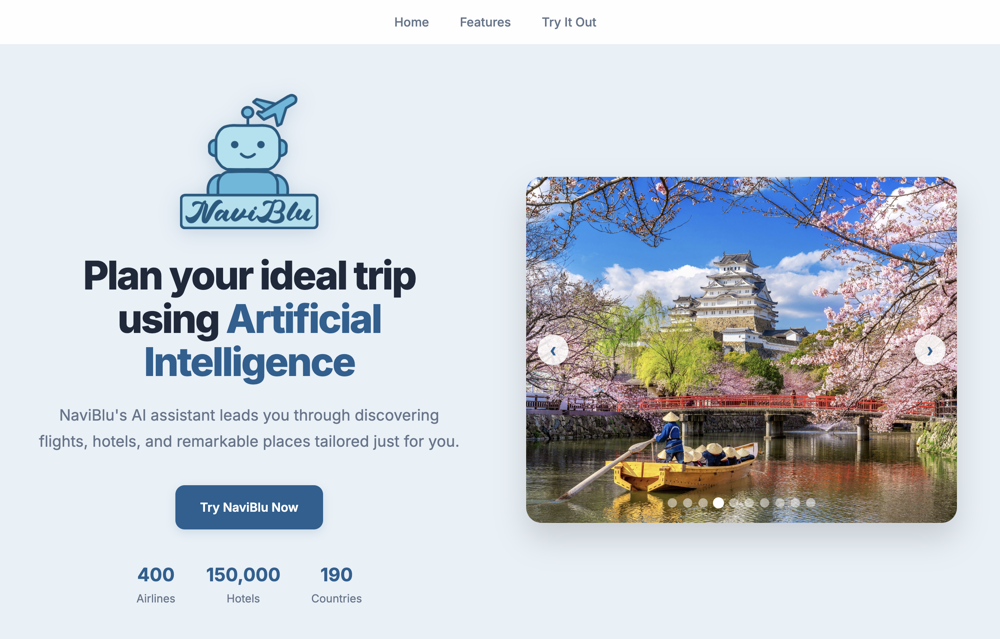
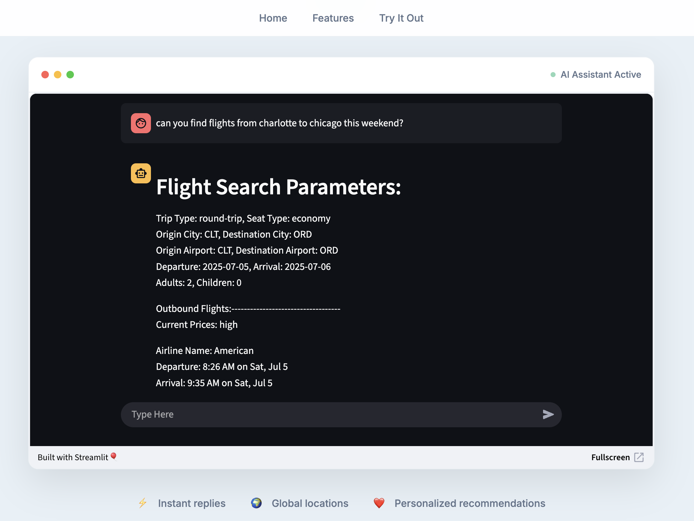

# NaviBlu Travel Assistant
AI chatbot to provide flight and hotel options as well as general travel information.

Built on top of Meta's llama-3.3-70b.

Available here: https://naviblu-travel-chatbot.onrender.com/

 

# Installation:

requires a .env file with:

GROQ_API_KEY to be able to make LLM calls. https://developers.amadeus.com/self-service/category/hotels/api-doc/hotel-search

AMADEUS_API_KEY and AMADEUS_API_SECRET to retrieve hotel information. https://github.com/ITCS-6112-Group-5/Travel_Chatbot

Create a virtual environment and install dependencies from requirements.txt using "pip install -r requirements.txt"

Uses python 3.13.2
